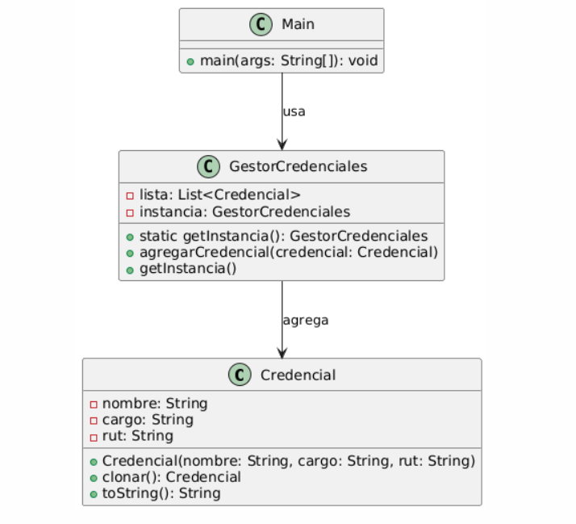
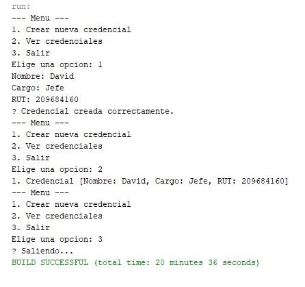

## 🪪 Generador de Credenciales de Evento

- Estudiante(s):
David Frías – Patrones de Diseño (Sección 2)
José Méndez – Patrones de Diseño (Sección 2)

### 🎯 Objetivo del Proyecto
----

Este sistema permite emitir credenciales personalizadas para un evento, a partir de una plantilla clonable. Se aplican los patrones de diseño Prototype (para clonar credenciales) y Singleton (para configuración global del evento).

### 🚀 Cómo ejecutar
----
1. Clonar el repositorio:
```
git clone https://github.com/0bamium/PatronesDeDise-o.git
cd PatronesDeDise-o
```
2. Compilar y ejecutar:
```
javac app/Main.java
java app.Main
```
----

### 🧬 Patrón Prototype – Aplicación
----
`Prototype` implementa `cloneable` en la clase Credencial creando una plantilla que podremos utilizar par agregar los datos del usuario.

```
Credencial nueva = plantillaBase.clonar();

System.out.print("Nombre: ");
nueva.setNombre(oScanner.nextLine());

System.out.print("Cargo: ");
nueva.setCargo(oScanner.nextLine());

System.out.print("RUT: ");
nueva.setRut(oScanner.nextLine());

gestor.agregarCredencial(nueva);
System.out.println("✅ Credencial creada correctamente.");
```
### 🔒 Patrón Singleton – Aplicación
----
`Singleton` contiene:
- Atributo que contiene una única instancia.
- Un constructor privado.
- Se accede con el método `getInstancia()`:

```
GestorCredenciales gestor = GestorCredenciales.getInstancia();
```

### 🖥️ Menú por consola
----
```
--- Menu ---
1. Crear nueva credencial
2. Ver credenciales
3. Salir
Elige una opcion:
```

### 📊 Diagrama de Clases (UML)
----


### 📸 Captura del sistema funcionando
----

